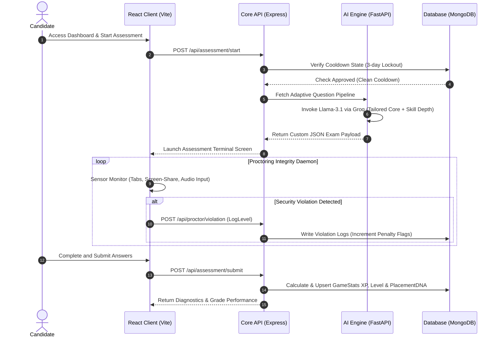
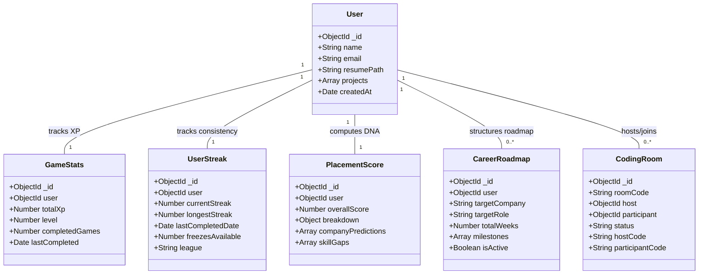

# Prepzo — AI Career Acceleration Platform 🚀

[](#)
[](#)
[](#)

---

## 💡 What is Prepzo? (In Simple Terms)

Think of Prepzo as a **flight simulator for getting a software engineering job**. 

Usually, preparing for interviews is stressful because you do not know what the interviewer will ask, or how strong your resume and coding skills look compared to others. Prepzo solves this by creating a mock placement environment. It diagnoses your skills using artificial intelligence, tracks your coding practice consistency, tests you in a proctored environment, and shows you exactly how ready you are for top companies.

---

## 🛠️ The Tech Stack: What We Used & Why

Prepzo is built using a modern **triple-tier architecture**:

```
┌────────────────────────────────────────────────────────────────────────┐
│                              FRONTEND                                  │
│ React (UI) + Vite (Build tool) + Tailwind (CSS) + Zustand (State)      │
└──────────────────────────────────┬─────────────────────────────────────┘
                                   │ HTTPS REST / API calls
                                   ▼
┌────────────────────────────────────────────────────────────────────────┐
│                            BACKEND CORE                                │
│                Node.js & Express.js (Database Routing)                 │
└──────────────────────────────────┬─────────────────────────────────────┘
                                   │ Database Queries / AI Microservice Sync
                                   ▼
┌────────────────────────────────────────────────────────────────────────┐
│                           AI & DATA SERVICES                           │
│     FastAPI (Python API) + MongoDB (Data) + Groq API (LLM Engine)      │
└────────────────────────────────────────────────────────────────────────┘
```

### 1. The Frontend (The User Interface)
*   **React 18**: A library used to build the user interface using reusable visual blocks called components.
*   **Vite**: A build tool that compiles and runs the frontend development server.
*   **TypeScript**: A typed extension of JavaScript that prevents coding errors by ensuring variables hold the correct types of data.
*   **Tailwind CSS**: A styling framework used to design premium visual themes (including dark-mode cards, glows, and animations).
*   **Zustand**: A lightweight state management library that stores application state (such as the logged-in user or active page navigation) globally.

### 2. The Backend Core (The Control Center)
*   **Node.js**: A runtime environment that runs JavaScript code outside of the web browser (on a server).
*   **Express.js**: A simple web framework running on Node.js used to build API endpoints (routes like `/api/login` or `/api/sprint/submit`).
*   **Mongoose**: A library that connects Node.js to MongoDB, defining clean validation schemas for our database.

### 3. The AI Microservice (The Intelligence Layer)
*   **FastAPI (Python)**: A high-performance Python framework used to handle complex calculations and AI processing.
*   **LangGraph**: A library that builds structured execution graphs to manage conversation loops for our AI Mentor.
*   **Groq API**: An inference service that hosts advanced models like `llama-3.1-70b` and `gemma2-9b` to generate custom questions, analyze audio inputs, and generate cover letters.

### 4. The Database (The Storage Room)
*   **MongoDB**: A database that stores data in JSON-like documents.

---

## 📁 Repository Directory Structure

Here is how the project files are organized:

```
Prepzo-Ai-Carrer-Platform/
│
├── .github/workflows/          # Automated GitHub Actions configurations
│   └── daily-commit.yml        # Daily streak runner script
│
├── backend/                    # Node.js Core Backend Service
│   ├── src/
│   │   ├── controllers/        # Logical controllers (the brains behind the routes)
│   │   ├── middleware/         # Security guards (validates logins & checks limits)
│   │   ├── models/             # Database schemas (User, GameStats, etc.)
│   │   ├── routes/             # REST API endpoint definitions
│   │   └── server.js           # Server startup script
│   └── .env.example            # Sample configuration template
│
├── frontend/                   # React TypeScript Frontend Client
│   ├── src/
│   │   ├── components/         # Reusable UI elements (buttons, navigation, loaders)
│   │   ├── pages/              # Platform feature pages (DailySprint, PlacementDNA, etc.)
│   │   ├── api/                # Axios configuration to connect with backend endpoints
│   │   ├── App.tsx             # Root page-switching hub
│   │   └── main.tsx            # Application entrance point
│   └── package.json            # NPM dependencies configuration
│
└── scripts/                    # Platform scripts
    └── daily_commit.js         # Streak automation program
```

---

## 🏛️ System Diagrams

### 🔄 Request-Response Lifecycle (UML Sequence)

This diagram shows how data flows between components when a candidate takes an assessment:



### 📊 Database Entity Relationships (UML Class Diagram)

This diagram maps how different models in the database relate to one another:



---

## 🔍 How Every Feature Works Under the Hood

### 1. 🎯 Adaptive Assessment Engine
*   **How it works**: When you start a test, the FastAPI microservice sends your profile info to the Llama-3.1 LLM via Groq. The AI generates custom core questions plus deep-dive questions based on your specific skills. 
*   **Continuous Seeding**: A background seed worker regularly generates and caches questions in MongoDB. This ensures that when a candidate takes a test, they get questions immediately, avoiding API rate-limit bottlenecks.

### 2. 🛡️ Proctoring & Sensor Integrity
*   **How it works**: As you take an assessment, background listeners monitor browser state. If you open a new tab, press `Ctrl+C`/`Ctrl+V`, disconnect screen-sharing, or generate loud noises, the system registers a violation log in MongoDB and increments your penalty flags.

### 3. 🧠 AI Mentor & Behavioral Counselor
*   **How it works**: A conversational agent is available directly on the dashboard. You can select specific interview modes (such as "Google Googliness" or "Amazon Leadership Principles") to conduct stress-test chats.

### 4. 🥇 Daily Sprint Loop
*   **How it works**: A timed 3-round sprint tests your knowledge daily. An SVG ring acts as a visual 90-second countdown. If you miss a day, the system decrements a "Streak Freeze" token to preserve your active streak. Correct answers reward XP, promoting you through Bronze to Diamond leagues.

### 5. 🧬 Placement DNA
*   **How it works**: Calculates a readiness grade based on resume strength, technical XP, interview performance, and project portfolio. It maps this data into a visual radar chart and compares it with company requirements to calculate your target match percentage.

### 6. 🗺️ Career Roadmap Planner
*   **How it works**: Calculates a week-by-week timeline tailored for your target company tier (such as FAANG or Startups). Tasks are connected directly to active platform tools (e.g. system design whiteboards) and are marked complete as you build progress.

### 7. 🎬 Interview Replay Theater
*   **How it works**: Analyzes video and audio records of your mock interviews. It counts filler words like "um" and "like", graphs words-per-minute pacing, and flags moments where you displayed strong confidence or lost focus.

### 8. 💻 Live Coding Room
*   **How it works**: A multiplayer workspace where candidates can coordinate real-time coding tasks. An integrated hint system monitors helper usage to evaluate candidate independence levels.

---

## 🔧 Developer Sandboxes & Extensions

*   **AI Cover Letter Matcher**: Compiles resume data and job details to output matching, high-conversion cover letters.
*   **ATS Match Optimizer**: Analyzes job listings and outputs resume optimization updates.
*   **DSA Pattern Flashcards**: Gamified spaced-repetition cards covering algorithms like Sliding Window and Two Pointers.
*   **Cyberpunk Portfolio Builder**: Exports interactive HTML portfolio packages themed in neon layouts.
*   **STAR Method Audio Coach**: Live speech analyzer measuring STAR (Situation, Task, Action, Result) answers.
*   **System Design Topology Simulator**: Renders network components (servers, databases, load balancers) to simulate data throughput limits.

---

## 👑 Administrative Operations Control

An advanced workspace console built for platform admins and colleges:
*   **Placements Drive Planner**: Orchestrates institutional recruitment events, provisions candidate groups, and tracks overall metrics.
*   **Bulk Generation Provisioners**: Auto-creates candidate mock data logs for system testing.
*   **Violation Logs Telemetry**: Review candidate warnings, tab violations, and screen-sharing disconnects in a detailed grid.
*   **Dossier Exporters**: Click to download student summaries and scores in Excel or print-ready PDF formats.

---

## ⚙️ Getting Started & Local Setup

### 1. Clone the Repository
```bash
git clone https://github.com/ayushsoni05/Prepzo-Ai-Carrer-Platform.git
cd Prepzo-Ai-Carrer-Platform
```

### 2. Configure Backend Service
```bash
cd backend
npm install

# Create a `.env` file inside /backend with the following keys:
# MONGODB_URI=your_mongodb_connection_string
# JWT_SECRET=your_jwt_secret
# PORT=5000

npm run dev
```

### 3. Run React Frontend
```bash
cd ../frontend
npm install
npm run dev
```

Open `http://localhost:5173` in your browser.
