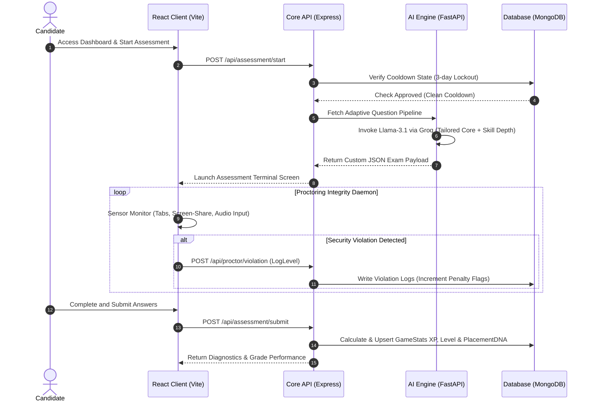
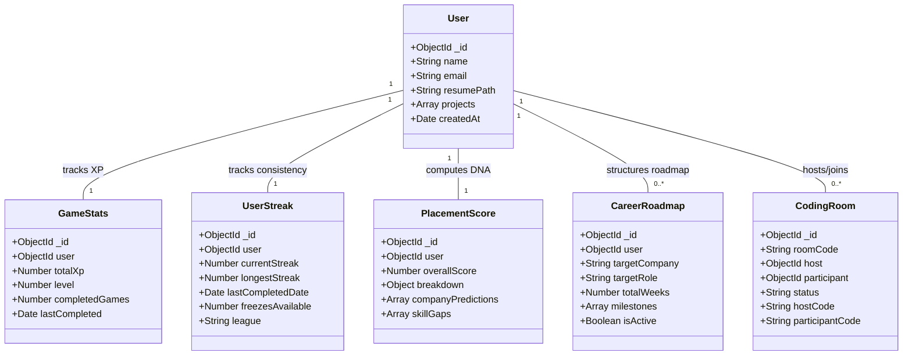

# Prepzo — AI Career Acceleration Platform 🚀

[](#)
[](#)
[](#)

Prepzo is a production-grade, AI-orchestrated technical diagnostic and career acceleration ecosystem. It simulates rigorous recruitment environments through adaptive cognitive assessments, real-time audio/visual proctoring, dynamic path roadmaps, and detailed placement readiness mapping.

---

## 🏛️ System Architecture

### 🔄 Request-Response Lifecycle (UML Sequence)

This sequence diagram illustrates how candidate assessments, proctoring controls, and adaptive AI question generation flow through the platform's microservices:



---

## 📊 Database Domain Model (UML Class Diagram)

The entity relationships showing candidate profiles, tracking telemetry, active roadmaps, and gaming stats are mapped below:



---

## ⚡ Core Platform Features

### 1. 🎯 Adaptive Assessment Engine
*   **Dual-Stage Evaluation Pipeline**: Executes a Field Core assessment (60 questions on fundamentals) followed by a deep-dive Skill Depth stage tailored specifically to user-defined technologies.
*   **Autonomous Seed Engine**: A continuous background process that safely populates MongoDB with unique question pools using API rate-limit smoothing.
*   **Three-Day Cooldown**: Restricts assessment attempts to three-day intervals to measure long-term retention.

### 2. 🛡️ Proctoring & Sensor Integrity
*   **Dynamic Sensor Daemons**: Captures screen-sharing state, tab focus, keyboard combinations, and background decibels.
*   **Automated Violation System**: Auto-flags candidates who attempt tab navigation, lockouts, or unauthorized copy/paste actions.

### 3. 🧠 AI Mentor & Behavioral Counselor
*   **Adaptive Persona Training**: Chat directly with AI coaches configured for specific company cultures (e.g. Google's Googliness vs. Amazon's Leadership Principles).
*   **Stress Interview Emulation**: Interactive mock sessions designed to test situational confidence under pressure.

### 4. 🥇 Daily Sprint Loop
*   **Streak Freeze Protection**: Decrements active freezes to protect consistency scores during offline periods.
*   **XP Multipliers**: Awards speed-based XP bonuses on correct answers.
*   **Division Leagues**: Promotes players through Bronze, Silver, Gold, Platinum, and Diamond tiers.

### 5. 🧬 Placement DNA
*   **Heatmap Gap Matrices**: Highlights delta values between current performance and target hiring metrics.
*   **Match Predictor**: Computes real-time match indices for major target companies based on assessment scores.

### 6. 🗺️ Career Roadmap Planner
*   **Scalable Timelines**: Generates 10-to-16-week prep roadmaps aligned with candidate tiers (FAANG, Product-focused, Startups).
*   **Interactive Node Navigation**: Seamlessly routes tasks to Prepzo platforms (e.g., Code Golf, Trivia, System Whiteboards).

### 7. 🎬 Interview Replay Theater
*   **Speech Pacing Tracker**: Charts words-per-minute (WPM) speed against performance averages.
*   **Filler Word Timeline**: Identifies exact timestamps of spoken filler words (e.g., "like", "uh", "um").

### 8. 💻 Live Coding Room
*   **Collaborative Sessions**: Instant multiplayer text synchronization via websocket coding channels.
*   **Hint Tracking**: Monitors the helper prompts utilized to calculate candidate independence scores.

---

## 🛠️ Developer Utilities (Integrated Extensions)

*   **AI Cover Letter Matcher**: Compiles resume data and job details to output matching, high-conversion cover letters.
*   **ATS Match Optimizer**: Analyzes job listings and outputs resume optimization updates.
*   **DSA Pattern Flashcards**: Gamified spaced-repetition cards covering algorithms like Sliding Window and Two Pointers.
*   **Cyberpunk Portfolio Builder**: Exports interactive HTML portfolio packages themed in neon layouts.
*   **STAR Method Audio Coach**: Live speech analyzer measuring STAR (Situation, Task, Action, Result) answers.
*   **System Design Topology Simulator**: Renders network components (servers, databases, load balancers) to simulate data throughput limits.

---

## 👑 Competitor-Beating Admin Console

An analytics dashboard offering administration over candidate metrics:
*   **Mock Placements Drive**: Plans placement events, manages candidate rosters, and exports scores.
*   **Sandbox Code Workspace**: Fully-isolated environment to run, test, and write code scripts.
*   **Telemetry Logs**: Real-time audit trails of proctoring violations and test telemetry.
*   **Bulk Provisioners**: Auto-creates mock candidates, scores, and track progress datasets for demonstration.
*   **Performance Dossier Exporter**: Download comprehensive student details in Excel or print-ready PDF formats.

---

## ⚙️ Getting Started & Local Setup

### Prerequisites
*   Node.js (v18+)
*   Python (3.10+)
*   MongoDB (v6+)

### 1. Clone the Repository
```bash
git clone https://github.com/ayushsoni05/Prepzo-Ai-Carrer-Platform.git
cd Prepzo-Ai-Carrer-Platform
```

### 2. Configure Backend Service
```bash
cd backend
npm install
# Add a `.env` file with MONGODB_URI and JWT_SECRET keys
npm run dev
```

### 3. Run React Frontend
```bash
cd ../frontend
npm install
npm run dev
```

Open `http://localhost:5173` to access the Prepzo acceleration portal.
